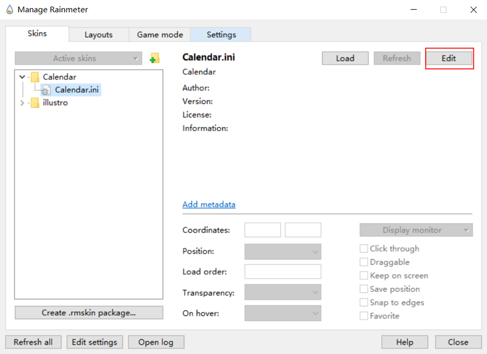
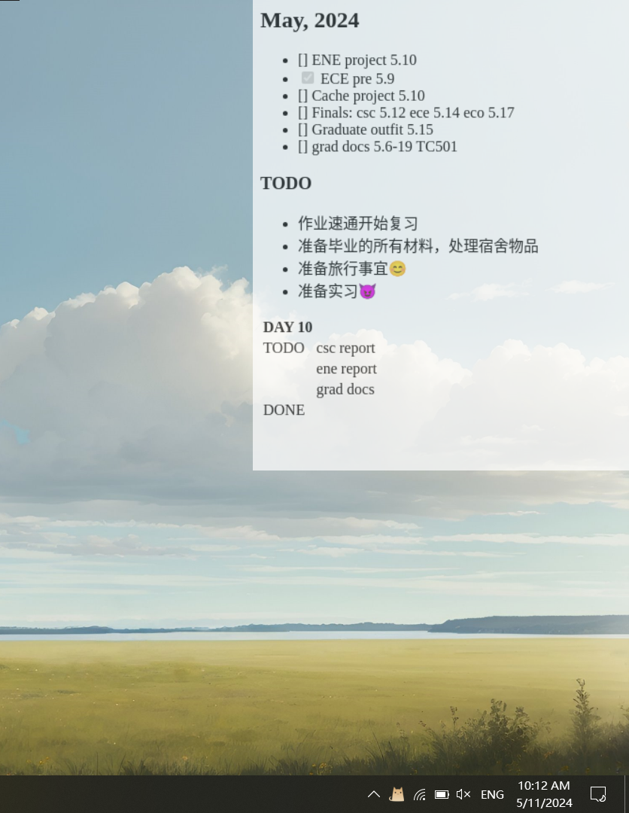

# MDtask 
*Markdown task board in WSL2 with windows display*

## Installation
### Make sure you have **pandoc** and  **wkhtmltoimage** in your wsl2.
```
sudo apt install pandoc
sudo apt install wkhtmltoimage
sudo apt-get install fonts-wqy-zenhei
``` 
### Get the task repo.
```
cd /any place you prefer
git clone https://github.com/Ruihan11/MDtask.git
``` 
  
### Install Rainmeter in your windows https://www.rainmeter.net/.

### Open it, make a new skin, and click on the following botton.  

### Copy and paste the following to your **ini** file. Adjust "ImageCrop" if your display is not ideal.
```
[Rainmeter]
Update=1000
DynamicWindowSize=1

[Image]
Meter=Image
ImageName="\\wsl.localhost\Ubuntu-20.04\home\dir to the target png file"
PreserveAspectRatio=2
ImageCrop=0,0,400,500
```  
### Open the **autopush.sh**, and change the dir to your rainmeter.exe.
```
/mnt/d/your_dir_to_rainmeter/Rainmeter.exe \!Refresh "Calendar"
```
### All good.

## In a beautiful morning  
*I made myself a fine cup of coffee and clicked on my WSL2 MDtask directory.*
```
cd /your MDtask
```  
*I sorted out what I was gonna do in **task.md** based on DDL or other plans*
```
bash autopush.sh
```  
*What a beautiful and productive day.*

